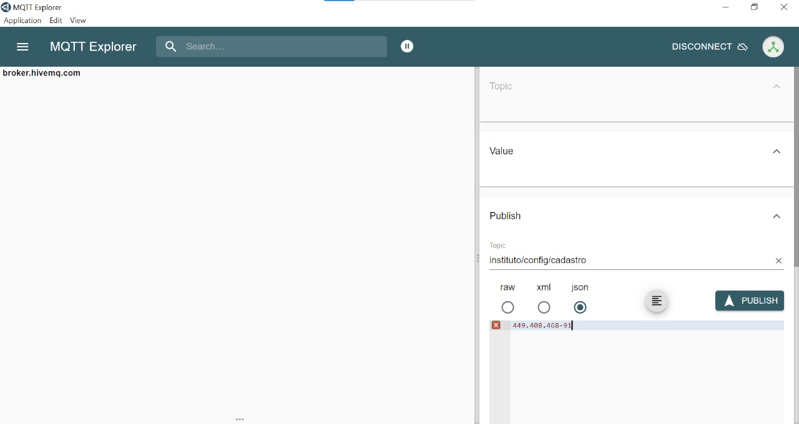
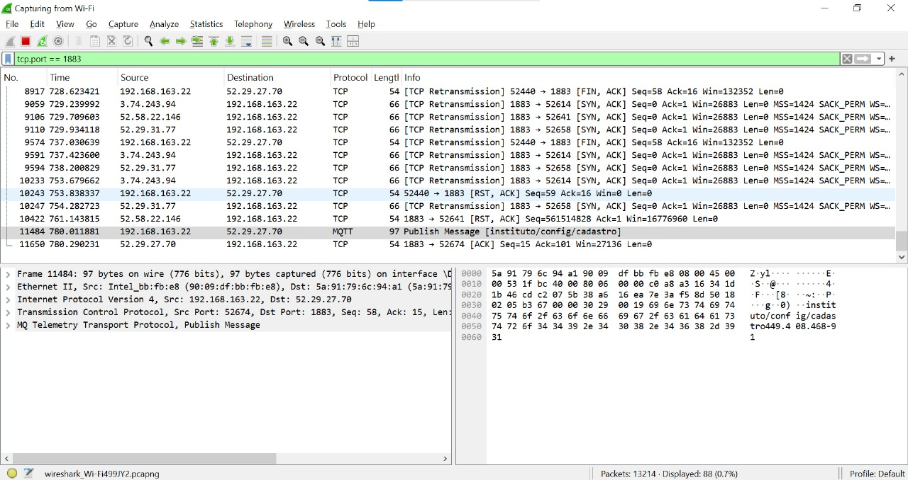

# Ponderada de Programação (Semana 9): Visão Geral sobre Segurança em IoT

## Grupo 4 Apontados 


## 👨‍🎓 Integrantes: 
<div align="center">
  <table>
    <tr>
      <td align="center"><a href="https://www.linkedin.com/in/fernando-soares-oliveira/"><br><sub><b>Fernando Oliveira</b></sub></a></td>
      <td align="center"><a href="https://www.linkedin.com/in/bernardofmeirelles/"><br><sub><b>Bernardo Meirelles</b></sub></a></td>
      <td align="center"><a href="https://www.linkedin.com/in/larissa-temoteo/"><br><sub><b>Larissa Temoteo</b></sub></a></td>
      <td align="center"><a href="https://www.linkedin.com/in/j%C3%BAlia-alvesdejesus/"><br><sub><b>Júlia Alves<//b></sub></a></td>
      <td align="center"><a href="https://www.linkedin.com/in/tainacortez/"><br><sub><b>Tainá Cortez</b></sub></a></td>
      <td align="center"><a href="https://www.linkedin.com/in/julia-lika-ishikawa/" ><br><sub><b>Julia Lika</b></sub></a></td>
    </tr>
  </table>
</div>


### **Vulnerabilidades Identificadas**
1. **Falta de Criptografia no MQTT**:
   - As mensagens trafegam em texto puro.
   - **Impacto**: Exposição a ataques Man-in-the-Middle.

2. **Configuração Wi-Fi com Credenciais Fracas**:
   - Uso de redes não protegidas ou senhas simples.
   - **Impacto**: Risco de invasão.

3. **Ausência de Validação de Mensagens MQTT**:
   - Mensagens maliciosas podem ser aceitas sem autenticação.
   - **Impacto**: Controle não autorizado do sistema.

4. **Armazenamento Frágil de Digitais**:
   - Modelos biométricos são manipulados sem criptografia.
   - **Impacto**: Violação de dados sensíveis.

---

## **Ataques Simulados**

### **1 - Análise de Tráfego de Rede: Captura de Mensagens MQTT**

#### **Objetivo**
Realizar a interceptação e análise de mensagens publicadas pelo ESP32 no broker MQTT, utilizando o Wireshark, para identificar possíveis vulnerabilidades na comunicação.

---

## **Descrição da Atividade**

### **1. Processo Realizado**
- A análise de tráfego foi conduzida utilizando a ferramenta **Wireshark** para capturar pacotes enviados pelo ESP32.
- O objetivo foi inspecionar as mensagens publicadas no broker MQTT e avaliar se essas mensagens eram trafegadas de forma segura.

---

### **2. Ferramentas Utilizadas**
- **Hardware**:
  - ESP32 conectado a uma rede Wi-Fi.
- **Software**:
  - Wireshark: Ferramenta para captura e análise de tráfego de rede.
- **Protocolo Avaliado**:
  - MQTT na porta padrão `1883` (sem criptografia).

---

## **Procedimentos**

### **Passo-a-Passo da Captura**
1. **Configuração do Wireshark**:
   - Filtro aplicado:
     ```plaintext
     tcp.port == 1883
     ```
   - Este filtro capturou apenas pacotes MQTT trafegando na rede.
   - O ESP32 e o meu computador estiveram logados o tempo todo na mesma rede.

2. **Execução do ESP32**:
   - O ESP32 foi programado para publicar mensagens no tópico `instituto/biometria/cadastro`.

3. **Captura de Pacotes**:
   - Pacotes MQTT foram identificados no Wireshark, com os seguintes detalhes:
     - **Tipo de Mensagem**: `PUBLISH`.
     - **Tópico**: `instituto/biometria/cadastro`.
     - **Payload**:
       ```json
       {"449.408.468-90"}
       ```

4. **Análise**:
   - O payload da mensagem estava trafegando em texto puro, sem criptografia.

---

## **Resultados Obtidos**

### **1. Exposição de Dados**
- As mensagens MQTT capturadas continham informações críticas, como IDs de usuários, em formato texto puro.
- Qualquer dispositivo na mesma rede Wi-Fi pode interceptar e visualizar essas mensagens.

### **2. Vulnerabilidade Identificada**
- **Falta de Criptografia**:
  - As mensagens não estavam protegidas por SSL/TLS, expondo o sistema a ataques de interceptação (Man-in-the-Middle).
---

## **Impacto**

### **1. Confidencialidade**
- Informações sensíveis, como IDs de acesso ou CPF, como no exemplo, podem ser interceptadas por um atacante.

### **2. Possibilidade de Ataques**
- Um atacante pode reutilizar mensagens capturadas (ataque de replay) para simular acessos autorizados.
- Mensagens podem ser manipuladas para alterar o comportamento do sistema.

---
### Imagens

<div align="center">
  <sub>Figura 1 - Imagem do MqttExplorer - Publicando mensagem</sub><br>
  <br>
  <sup>Fonte: Material produzido pelos autores (2024)</sup>
</div>

<div align="center">
  <sub>Figura 2 - Imagem do WireShark</sub><br>
  <br>
  <sup>Fonte: Material produzido pelos autores (2024)</sup>
</div>

 ### **Descrição**
A imagem representa a captura de tráfego de rede utilizando o Wireshark, onde foi interceptada uma mensagem MQTT publicada pelo dispositivo ESP32 em um broker público. Esta análise foi realizada para avaliar a segurança da comunicação e identificar possíveis vulnerabilidades.

  ### **Contexto Técnico**
- **Protocolo**: MQTT.
- **Tópico Capturado**: `instituto/config/cadastro`.
- **Payload da Mensagem**:
  ```json
  {"449.408.468-91"}
´´´

Este payload demonstra a transmissão de um dado sensível, como CPF, de forma não criptografada.

### **Detalhes da Captura**

Filtro Aplicado no Wireshark:
- O filtro utilizado foi:
  ```plaintext
  tcp.port == 1883
´´´
Esse filtro captura apenas pacotes MQTT que trafegam pela porta padrão do protocolo (1883).

### **Mensagem Publicada**
O protocolo MQTT apresenta uma mensagem do tipo Publish Message publicada no tópico específico.

### **Fonte e Destino**
- Fonte (Source): 192.168.163.22 (possivelmente o endereço IP local do ESP32).
- Destino (Destination): 52.29.27.70 (endereço IP do broker MQTT público).

### **Vulnerabilidade Identificada**
A mensagem interceptada evidencia a falta de criptografia na comunicação MQTT, resultando em:
- Exposição de dados sensíveis para qualquer atacante na mesma rede local.
- Potencial para ataques de interceptação e replay.

### **Impacto**
- Confidencialidade Comprometida:
Qualquer dado sensível enviado (como IDs, CPFs ou comandos) pode ser interceptado e lido por terceiros.
- Risco de Controle Não Autorizado:
Um invasor pode capturar e reutilizar a mensagem para executar ações repetidas ou maliciosas.

---

# **2 - Ataque de Injeção de Comandos MQTT**

## **Objetivo**
Demonstrar como a exposição de tópicos públicos no broker MQTT compromete a segurança de um sistema IoT, permitindo que comandos maliciosos sejam enviados manualmente para manipular o sistema.

---

## **Descrição da Atividade**

### **1. Processo Realizado**
- Utilizou-se a ferramenta **MQTT Explorer** para identificar e publicar mensagens manualmente em tópicos MQTT acessíveis publicamente.
- O foco foi explorar a vulnerabilidade gerada pela ausência de autenticação e a configuração de tópicos públicos no broker MQTT.

---

## **Ferramentas Utilizadas**
- **Hardware**:
  - ESP32 conectado ao broker MQTT.
- **Software**:
  - MQTT Explorer: Ferramenta GUI para interação com brokers MQTT.
- **Protocolo Avaliado**:
  - MQTT na porta padrão `1883`, com tópicos configurados como públicos. Vale mencionar que nossos tópicos são todos públicos no momento, devido ao problema com SSL. 

---

## **Procedimentos**

### **Passo-a-Passo**
1. **Conexão ao Broker MQTT**:
   - Conecte-se ao broker público `broker.hivemq.com` sem autenticação, utilizando a porta `1883`.

2. **Exploração de Tópicos Públicos**:
   - Inspecione os tópicos disponíveis usando o MQTT Explorer, como:
     - `instituto/biometria/acesso`
     - `instituto/config/cadastro`

3. **Injeção de Comandos**:
   - No tópico `instituto/config/cadastro`, publique a seguinte mensagem maliciosa:
     ```json
     {"id": "Fernando Soares de Oliveira"}
     ```
   - Esta mensagem simula o cadastro de um ID fictício diretamente no sistema.

4. **Resultados no ESP32**:
   - Verifique no ESP32 se o sistema processa a mensagem e registra o ID `Fernando Soares de Oliveira`.

---

## **Resultados Obtidos**

### **1. Exploração de Vulnerabilidades**
- A configuração de **tópicos públicos** permitiu que qualquer usuário conectado ao broker publicasse mensagens nos tópicos do sistema.

### **2. Impacto Observado**
- **Controle Não Autorizado**:
  - O sistema aceitou a mensagem maliciosa e cadastrou o usuário fictício, sem qualquer tipo de autenticação.
- **Exposição a Manipulação Remota**:
  - Qualquer cliente pode enviar comandos diretamente ao sistema, comprometendo sua integridade e funcionamento.

---

## **Impacto**

### **1. Violação da Integridade**
- Dados sensíveis e operações críticas do sistema podem ser manipulados por usuários não autorizados.

### **2. Risco de Escalabilidade**
- A utilização de tópicos públicos facilita ataques massivos, como:
  - **Automação de Ataques**: Enviar comandos repetidos para manipular registros em massa.
  - **Ataques de Negação de Serviço (DoS)**: Publicação contínua para sobrecarregar o sistema.

### **3. Acessibilidade Global**
- A exposição de tópicos públicos torna o sistema vulnerável a atacantes de qualquer localidade, desde que tenham acesso ao broker.

---

## **Vídeo**

Confira o vídeo de demonstração da injeção: [[Link para o vídeo](https://drive.google.com/drive/folders/1rYCFgfHRnIQJ2FpryTkRZxt0tyquWyJ-?usp=sharing)].


---


# **3 - Rede Wi-Fi Frágil**

## **Descrição da Vulnerabilidade**
A rede Wi-Fi utilizada pelo ESP32 apresenta características que a tornam vulnerável a ataques:

1. **Credenciais Fracas**:
   - Senhas simples ou padrão (ex.: "12345678") são fáceis de serem comprometidas por ataques de força bruta.
     
2. **Exposição da Rede**:
   - Redes abertas ou sem criptografia expõem todos os dispositivos conectados a interceptação.
   - Rede configurada com criptografia fraca (ex.: WEP ou WPA desatualizado).

---

## **Impactos**

### **1. Interceptação de Tráfego**
- Um atacante conectado à mesma rede pode capturar pacotes enviados pelo ESP32, comprometendo a confidencialidade das mensagens.
- Ferramentas como Wireshark tornam fácil capturar mensagens MQTT trafegando em texto puro.

### **2. Controle Não Autorizado**
- Um invasor pode enviar comandos MQTT ou realizar ataques de replay caso consiga capturar a comunicação.

### **3. Ataques em Cadeia**
- A partir da rede comprometida, o atacante pode explorar outros dispositivos conectados, escalando o ataque para todo o sistema.

---

## **Possíveis Ataques**
1. **Ataque de Força Bruta**:
   - Testar combinações de senhas para acessar a rede Wi-Fi.
2. **Captura de Credenciais**:
   - Em redes abertas, o atacante pode capturar credenciais de outros dispositivos conectados.
3. **Intercepção de Mensagens MQTT**:
   - Uma vez conectado, o atacante pode capturar mensagens enviadas e publicadas.

---

## **Recomendações de Mitigação**
1. **Usar Criptografia WPA2 ou WPA3**:
   - Configurar a rede Wi-Fi para utilizar protocolos modernos de criptografia.
2. **Adotar Senhas Fortes**:
   - Utilizar uma senha complexa, com no mínimo 12 caracteres, incluindo letras maiúsculas, minúsculas, números e símbolos.
3. **Isolamento de Rede**:
   - Criar uma rede dedicada apenas para dispositivos IoT, separada da rede principal.
4. **Ocultar o SSID da Rede**:
   - Configurar o roteador para não transmitir o SSID publicamente.
5. **Autenticação Adicional**:
   - Implementar autenticação baseada em certificados para conexões críticas (ex.: MQTT seguro).

---


# **Tabela Consolidada dos Ataques**

| **Título do Ataque**                   | **Probabilidade** | **Impacto**            | **Risco Resultante**     |
|----------------------------------------|-------------------|------------------------|--------------------------|
| Injeção de Comandos MQTT               | Alta              | Controle Não Autorizado | Alto                    |
| Captura de Mensagens MQTT (Wireshark)  | Alta              | Exposição de Dados      | Alto                    |
| Rede Wi-Fi Frágil                      | Média             | Acesso Não Autorizado   | Médio                   |


--- 


## **Referências**
1. Random Nerd Tutorials. *ESP32 Web Server*. Disponível em: [https://randomnerdtutorials.com/esp32-web-server-arduino-ide/](https://randomnerdtutorials.com/esp32-web-server-arduino-ide/).
2. MQTT Explorer. Disponível em: [https://mqtt-explorer.com/](https://mqtt-explorer.com/).
3. Wireshark Documentation. Disponível em: [https://www.wireshark.org/docs/](https://www.wireshark.org/docs/).

