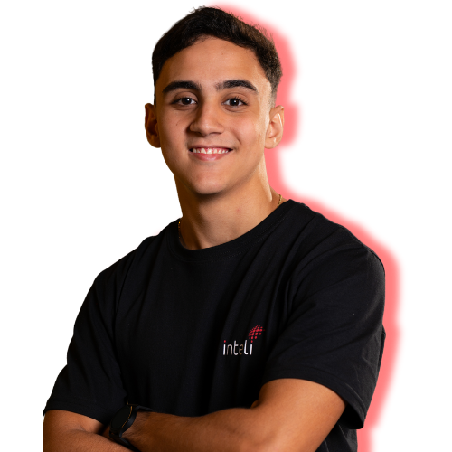
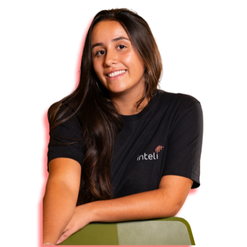

# Ponderada de Programação (Semana 9): Visão Geral sobre Segurança em IoT

## Grupo 4 Apontados 

## 👨‍🎓 Integrantes: 

  <table>
    <tr>
      <td align="center"><a href="https://www.linkedin.com/in/fernando-soares-oliveira/"> <b>Fernando Oliveira</b></a></td>
      <td align="center"><a href="https://www.linkedin.com/in/bernardofmeirelles/"> <b>Bernardo Meirelles</b></a></td>
      <td align="center"><a href="https://www.linkedin.com/in/larissa-temoteo/"> <b>Larissa Temoteo</b></a></td>
      <td align="center"><a href="https://www.linkedin.com/in/j%C3%BAlia-alvesdejesus/"> <b>Júlia Alves<//b></a></td>
      <td align="center"><a href="https://www.linkedin.com/in/tainacortez/"> <b>Tainá Cortez</b></a></td>
      <td align="center"><a href="https://www.linkedin.com/in/julia-lika-ishikawa/" > <b>Julia Lika</b></a></td>
    </tr>
  </table>

